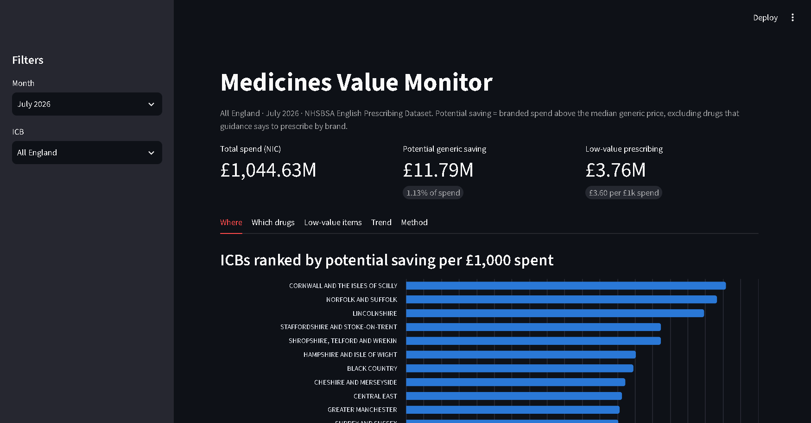
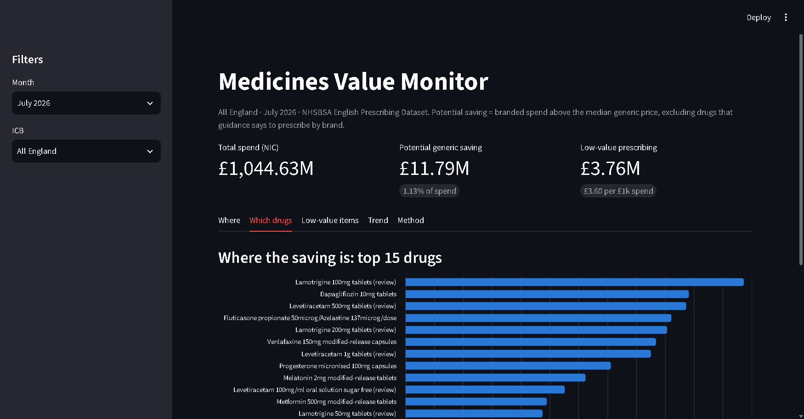

# Medicines Value Monitor


How much NHS England primary-care prescribing could be saved, and where? This project analyses **55 million rows** of NHSBSA English Prescribing Data (May–July 2026, ~£1bn/month) to answer two questions:

1. **Generic savings:** how much is spent on branded drugs above the price of their generic equivalent?
2. **Low-value prescribing:** how much goes on items NHS England says should not routinely be prescribed?

**DuckDB + dbt → Streamlit** (with a Parquet export for Power BI). Tested end to end in CI.



## Findings (July 2026)

| | |
|---|---|
| Total spend (net ingredient cost) | **£1,044.6M** |
| Potential generic saving | **£11.8M** (1.13% of spend) |
| Low-value prescribing | **£3.76M** across 21 NHS England categories |
| Variation between ICBs | **3×**, from £18.18 per £1,000 spent (Cornwall) to £6.05 (North East & North Cumbria) |

- **Largest savings:** dapagliflozin (generic launched but the brand is still prescribed), micronised progesterone, melatonin MR and venlafaxine MR. Lamotrigine and levetiracetam also rank high but are flagged **for clinical review**: switching antiepileptics is a prescriber's judgement.
- **Largest low-value spend:** lidocaine plasters (£1.3M/month), liothyronine (£0.8M) and immediate-release fentanyl (£0.3M).



## How it works

```
NHSBSA open-data API ──> ingest/epd.py ──> Parquet (1 file/month, 7.8 GB CSV → 310 MB)
                                              │
                               dbt-duckdb: staging → intermediate → marts   (32 models + tests)
                                              │
                         Streamlit dashboard  ·  Parquet export for Power BI
```

| Layer | What it does | Details |
|---|---|---|
| Ingest | Streams each monthly CSV from the API straight into Parquet. Nothing raw touches the disk | [phase 1](docs/phases/phase-1-ingest.md) |
| Profiling | Notebook that established what a row *means* before any logic was written | [notebook](notebooks/01_profiling.ipynb) · [phase 2](docs/phases/phase-2-staging.md) |
| Staging | Typed, renamed view. Derives generic flags from the BNF code structure | [phase 2](docs/phases/phase-2-staging.md) |
| Marts | Median generic reference price, savings with guidance-backed brand exceptions, low-value spend | [phase 3](docs/phases/phase-3-marts.md) |
| Dashboard | ICB → practice drill-down, top drugs, low-value categories, trend | [phase 4](docs/phases/phase-4-app.md) |
| CI & export | GitHub Actions builds everything on a real 77k-row sample; Parquet export for Power BI | [phase 5](docs/phases/phase-5-polish.md) |

Design and decisions: [docs/ARCHITECTURE.md](docs/ARCHITECTURE.md).

## Data quality highlights

- **`QUANTITY` is per prescription, not total.** Rows are split by prescription size, so unit prices use `TOTAL_QUANTITY`. This was proven on all 55M rows, and staging renames the column so it can't be misused.
- **Appliances use 11-character codes** with no generic structure, so the generic logic is limited to drugs.
- **A silent column overwrite:** DuckDB's hive-partition detection replaces `YEAR_MONTH` with the folder name unless it's disabled.
- **The totals reconcile to the penny** between staging and the headline mart (a dbt test).

## Run it

```bash
uv venv --python 3.12 .venv && uv pip install -r requirements.txt
.venv/Scripts/python ingest/epd.py --months 3      # ~30 min per month, ~310 MB Parquet each
cd dbt && ../.venv/Scripts/dbt build && cd ..      # 32 models, seeds and tests, ~1 min
.venv/Scripts/streamlit run app/streamlit_app.py   # dashboard at http://localhost:8501
.venv/Scripts/python scripts/export_marts.py       # optional: Parquet for Power BI -> data/export/
```

On macOS/Linux use `.venv/bin/` instead of `.venv/Scripts/`.

To try it without the 23 GB download, build on the bundled sample:

```bash
cd dbt && EPD_GLOB="$(pwd -W)/../tests/fixtures/epd/*/epd.parquet" ../.venv/Scripts/dbt build   # Windows (Git Bash)
cd dbt && EPD_GLOB="$(pwd)/../tests/fixtures/epd/*/epd.parquet" ../.venv/bin/dbt build          # macOS/Linux
```

This overwrites `data/warehouse.duckdb`. To keep your full build, also set `DUCKDB_PATH` to another file.

## Limitations

- Reference prices come from practice data, not the Drug Tariff.
- Rates are per £ of spend, not per patient (practice list sizes aren't included yet).
- Brand exceptions are applied to whole chemicals, which is conservative.
- 2 of NHS England's 23 low-value categories (bath emollients, insulin pen needles) are not covered.

## Data

Contains public sector information from the [NHSBSA Open Data Portal](https://opendata.nhsbsa.net/), licensed under the Open Government Licence v3.0. Low-value BNF code definitions are adapted from [OpenPrescribing](https://openprescribing.net/) (Bennett Institute, University of Oxford).
