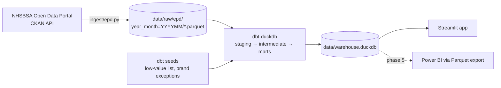

# Architecture & Plan

## Goal

Answer two questions from NHSBSA English Prescribing Data (EPD), by ICB and practice, month by month:

1. **Branded-generic waste:** how much is spent on branded products where a cheaper generic equivalent exists?
2. **Low-value prescribing:** how much is spent on items NHS England says should not routinely be prescribed in primary care?

## Pipeline



| Layer | Tool | Responsibility |
|---|---|---|
| Ingest | Python + DuckDB | Discover monthly resources via CKAN `package_show`, stream CSV → Parquet (one file per month), skip months already on disk |
| Transform | dbt-duckdb | Clean, type, derive BNF parts, compute savings/low-value marts, test |
| Serve | Streamlit (+ pandas) | Read-only queries against marts; charts and league tables |
| BI (later) | Power BI | Import mart Parquet exports |

## Data source

- Dataset: `english-prescribing-dataset-epd-with-snomed-code` on `opendata.nhsbsa.net`. It has one CSV per month (`EPD_SNOMED_YYYYMM`), runs from 2020-11, and each month is ~18.6M rows / ~7.7 GB. The older `english-prescribing-data-epd` stops at 2025-06, so we don't use it.
- Resource URLs are discovered via `package_show` (`DATASET` constant in `ingest/epd.py`), never hard-coded.
- Grain: practice × BNF presentation × SNOMED code × month.
  - Key columns: `YEAR_MONTH` (`YYYY-MM`), `ICB_CODE`, `PRACTICE_CODE`, `BNF_PRESENTATION_CODE`, `SNOMED_CODE`.
  - Measures: `ITEMS`, `QUANTITY`, `TOTAL_QUANTITY`, `ADQ_USAGE`, `NIC`, `ACTUAL_COST`.
- Unidentified prescribing appears as `PRACTICE_CODE = '-'` with `UNIDENTIFIED = 'Y'`.
- Ingest keeps all codes as text (preserving leading zeros) and casts only the measures to DOUBLE.
- **Schema drift:** months before July 2022 may use `STP_*` instead of `ICB_*`. We haven't checked, because the first 3 months are all ICB-era. Handle it in staging when backfilling.

## Repo layout

```
ingest/epd.py              # CKAN discovery + CSV→Parquet
dbt/
  dbt_project.yml
  profiles.yml             # duckdb path: ../data/warehouse.duckdb
  seeds/                   # low_value_medicines.csv, brand_exceptions.csv
  models/staging/          # stg_epd
  models/intermediate/     # int_generic_unit_price
  models/marts/            # fct_*, dim_*, mart_*
  tests/                   # singular tests (reconciliation)
app/streamlit_app.py
data/                      # gitignored: raw parquet + warehouse.duckdb
docs/ARCHITECTURE.md
```

## Models

**`stg_epd`** is a view over `read_parquet('data/raw/epd/*/*.parquet', hive_partitioning=true)`. It:
- lowercases column names, casts types, and coalesces `stp_*`/`icb_*` into `icb_*`
- derives the BNF code parts (15 characters):
  - `chemical_code` = chars 1–9
  - `product_code` = chars 10–11
  - `is_generic` = `product_code = 'AA'`
  - `generic_equiv_code` = chemical_code + `'AA'` + chars 14–15 + chars 14–15. This is the same rule OpenPrescribing uses.

**`int_generic_unit_price`** gives, per month and per generic BNF code, the median `nic / quantity` across practices. Using the median stops outlier practices from setting the reference price.

**Marts**

| Model | Grain | Logic |
|---|---|---|
| `dim_practice`, `dim_icb` | practice / ICB | Latest name/address per code |
| `mart_branded_savings` | practice × generic_equiv_code × month | Branded rows joined to the generic unit price. `saving = greatest(nic − quantity × generic_unit_price, 0)`. Excludes `brand_exceptions` seed rows (e.g. modified-release, narrow-therapeutic-index drugs, where prescribing by brand is correct) |
| `mart_low_value` | practice × category × month | EPD joined to the `low_value_medicines` seed on BNF chemical/prefix → items and cost |
| `mart_icb_monthly` | ICB × month | Rolls both marts up for the dashboard |

**Seeds** are small hand-curated CSVs checked into git.
- `low_value_medicines.csv`: `bnf_prefix, category, source_url`, built from the NHSE guidance.
- `brand_exceptions.csv`: `bnf_prefix, reason`.

**Tests**
- Generic tests: `not_null` and `unique` on mart grains, and `nic >= 0`.
- One singular test checks that `sum(nic)` in `stg_epd` equals raw Parquet per month, so rows can't silently drop.

## Key decisions

| Decision | Why | Revisit when |
|---|---|---|
| Parquet on disk, not DuckDB-only | Months stay immutable and re-runnable, and ingest is decoupled from transforms | — |
| Start with 3 recent months | ~50M rows fits a laptop, which keeps iteration fast | Trend analysis needs history → backfill 12–24 months |
| Staging as a view, marts as tables | No duplicate copy of 50M rows. Marts are small and fast for the app | Staging view gets slow → materialise it incrementally by `year_month` |
| No orchestrator (Airflow/Dagster) | Two commands, run monthly | Scheduled refresh is needed → GitHub Actions cron |
| Median practice price as generic reference | Simple and reproducible | Drug Tariff prices are wanted → add Drug Tariff Part VIIIA as a seed/source |
| No per-patient normalisation yet | Needs another dataset (practice list sizes) | Comparing practices fairly → add NHS Digital "Patients Registered at a GP Practice" |

## Phased plan

Each finished phase has a study write-up in [`docs/phases/`](phases/) covering decisions, trade-offs, concepts and interview Q&A.

| Phase | Deliverable | Done when |
|---|---|---|
| **0. Scaffold** | `pyproject.toml`/`requirements.txt` (duckdb, dbt-duckdb, pandas, streamlit, requests), `.gitignore` for `data/` | `dbt debug` passes |
| **1. Ingest** | `ingest/epd.py --months 3` | 3 Parquet files on disk; re-run is a no-op; row counts logged |
| **2. Staging** | `stg_epd` + source/column tests | `dbt build -s staging` green; STP/ICB coalesced across months |
| **3. Marts** | seeds + `int_generic_unit_price` + 3 marts + reconciliation test | `dbt build` green; top-10 ICB savings pass a spot check against OpenPrescribing |
| **4. App** | `app/streamlit_app.py`: KPI tiles, ICB league table, month trend, practice drill-down | Runs locally from `streamlit run`; <2s per interaction |
| **5. Polish** | Power BI export, GitHub Actions `dbt build` on a small fixture, README with screenshots, optional backfill | CI green; README tells the story |

## Run (target)

```bash
python ingest/epd.py --months 3
cd dbt && dbt build
streamlit run app/streamlit_app.py
```
